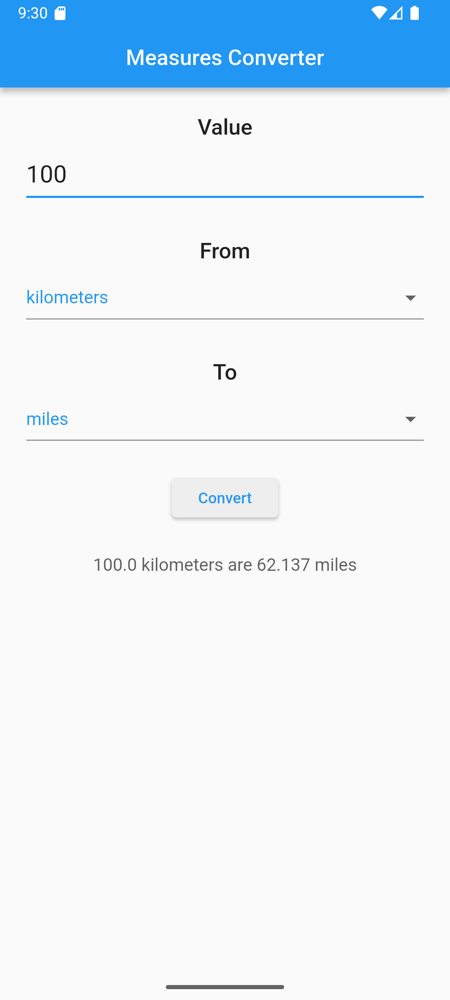
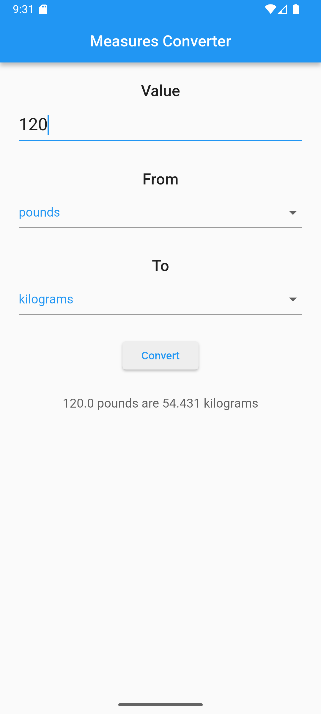

# Measures Converter

A Flutter project that converts between imperial and metric systems using Dart.

 

## Getting Started

Just enter a value, choose the `from` and `to` measuring unit and hit `Convert`!

You will have the results shown in your screen! It's that simple.

## Future development

- Adding a `Swap` button to quickly swap back and forth between measures
